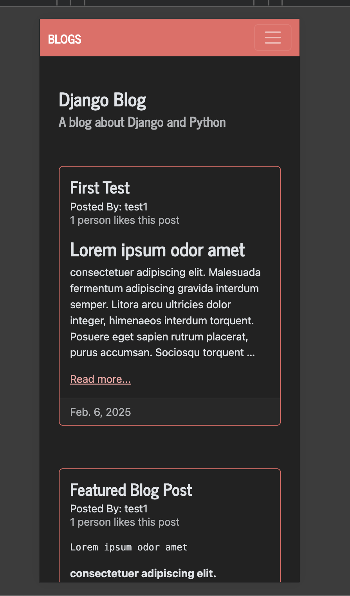

# Django Blog Application

This is a simple blog application built with **Django**, **Python**, and Bootstrap. It provides users with a clean and responsive interface to browse blog posts, featuring:

- A mobile-responsive navigation bar
- A paginated list of blog posts
- A featured post section
- User authentication: Sign up, Sign in, and Sign out
- The ability to like posts

The application is styled using Bootstrap and is designed to be user-friendly on both desktop and mobile devices.

## To run locally

1. First clone this repo:
   `git clone git@github.com:kassrojas/django-blog.git`

2. `cd django-blog`

3. set up a virtual environment:
   `python3 -m venv env`

4. activate the virtual environment

- MacOS/Linux `source env/bin/activate`

- Windows `.\env\Scripts\activate`

5. Install dependencies `pip install -r requirements.txt`

6. Set up default SQLite database `python3 manage.py migrate`. This will apply any database migrations aka create necessary tables for the Django app.

7. If you want to access the Django admin interface, create a super user: `python3 manage.py createsuperuser` and follow the prompts.

8. Everything is set up. Now, run the server with `python3 manage.py runserver`. You should see the application hosted on `http://127.0.0.1:8000/`

9. If you created a superuser, you can access the admin panel by navigating to `http://127.0.0.1:8000/admin/` and logging in using the credentials you set up.
